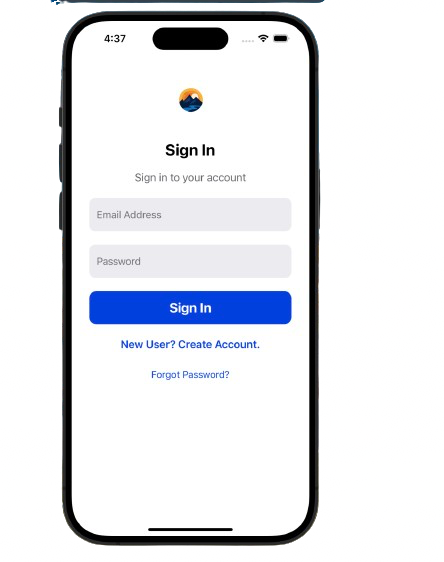
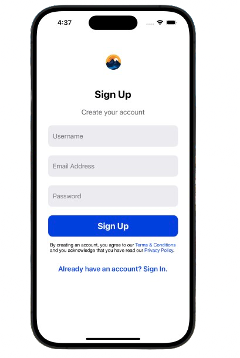
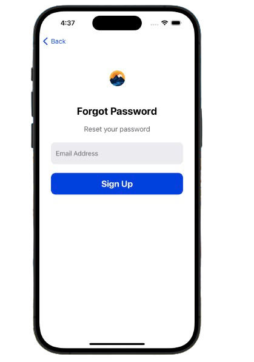

# Swift Authentication app with Firebase

Full featured universal (iOS, iPadOS) app.

    
    
    

## Overview
- Written in Swift
- Uses both UIKit 
- Auto layout Based
- Universal App: Run on iPhone, iPad
- Built in Xcode 14

## Design

The app has four key area:

1. Sign In 
2. Sign Up 
3. Forgot Password 
4. Home Controller

